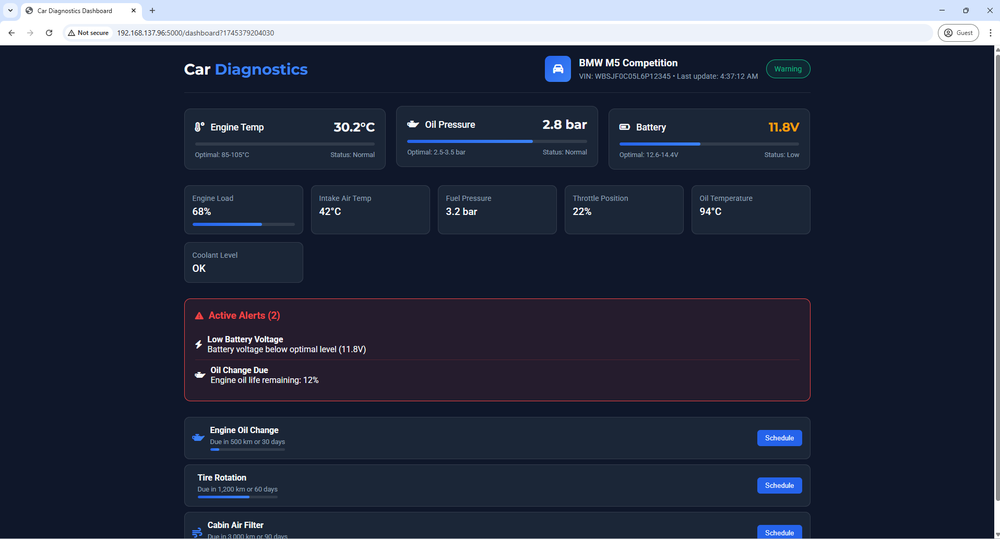

# Car Diagnostics Dashboard

## Overview
This project is a car diagnostics dashboard developed as part of my Master's studies in Embedded Systems and Robotics. It uses an ESP32 microcontroller to collect environmental data (temperature and humidity) from a DHT11 sensor, sends the data to a Flask server via HTTP, and displays it on a web-based dashboard. The system includes a secure login page and a responsive dashboard for real-time data visualization.

The project showcases my skills in embedded systems programming, sensor interfacing, network communication, and web development, demonstrating a seamless integration of hardware and software for IoT applications.

## Features
- **ESP32 Integration**: Collects temperature and humidity data using a DHT11 sensor and sends it to a Flask server via HTTP POST requests.
- **Flask Server**: A Python-based server that processes ESP32 data and serves a web interface.
- **Web Dashboard**: A user-friendly dashboard with a login page, displaying real-time sensor data.
- **Secure Access**: Requires login to access the dashboard.

## Requirements
### Hardware
- ESP32 development board
- DHT11 temperature and humidity sensor
- 4.7kΩ to 10kΩ pull-up resistor
- USB cable for ESP32 programming

### Software
- Arduino IDE (with ESP32 board support)
- Python 3.x
- Flask (`pip install flask`)
- Flask-CORS (`pip install flask-cors`)

## Setup Instructions
### 1. ESP32 Setup
1. **Install Arduino IDE**:
   - Download and install the Arduino IDE from [arduino.cc](https://www.arduino.cc/en/software).
   - Add ESP32 board support:
     - Go to **File > Preferences**, add `https://dl.espressif.com/dl/package_esp32_index.json` to "Additional Boards Manager URLs".
     - Go to **Tools > Board > Boards Manager**, search for "ESP32", and install the "esp32" package.
   - Install the DHT library:
     - Go to **Sketch > Include Library > Manage Libraries**, search for "DHT sensor library" by Adafruit, and install it.

2. **Connect the DHT11 Sensor**:
   - VCC → 3.3V (ESP32)
   - GND → GND (ESP32)
   - DATA → GPIO 4 (ESP32)
   - Add a 4.7kΩ to 10kΩ pull-up resistor between DATA and VCC.

3. **Upload the ESP32 Code**:
   - Open `esp32_car_monitor.ino` in the Arduino IDE.
   - Update the WiFi credentials and server URL:
     - `WIFI_SSID`: Your WiFi network name
     - `WIFI_PASSWORD`: Your WiFi password
     - `SERVER_URL`: Your Flask server URL (e.g., `http://192.168.137.96:5000/api/update`)
   - Go to **Tools > Board**, select "ESP32 Dev Module".
   - Select the correct port under **Tools > Port**.
   - Click the Upload button.

### 2. Flask Server Setup
1. **Set Up Python Environment**:
   - Install Python 3.x.
   - Install dependencies:
    
2. **Run the Flask Server**:
- Navigate to the `CarDashboard` directory.
- Run the server:
- The server should run on `http://127.0.0.1:5000` and your local IP (e.g., `http://192.168.137.96:5000`).

### 3. Access the Dashboard
- Open a browser and go to `http://192.168.137.96:5000`.
- Log in to access the dashboard.
- The dashboard will display the temperature and humidity data sent by the ESP32.

## Challenges Overcome
During development, I encountered and resolved the following issues:
- **DHT11 Sensor Reading Failure**:
- The ESP32 initially failed to read data from the DHT11 sensor, showing `Failed to read from DHT sensor!` errors.
- Resolution: After testing with `dht_test.ino`, adjusting GPIO pins, verifying wiring, and ensuring a stable power supply, the issue was resolved. Using a different sensor also helped confirm the root cause.
- **HTTP Request Errors**:
- The Flask server received malformed requests (`code 400, message Bad request version`), likely due to the ESP32 sending HTTPS requests instead of HTTP.
- Resolution: Updated the ESP32 code to ensure plain HTTP requests and tested with a public endpoint (e.g., `http://jsonplaceholder.typicode.com/posts/1`) to confirm functionality.

## About Me
Hi, I’m Anass Mokhtari, a Master’s student in Embedded Systems and Robotics, deeply passionate about creating solutions that fuse hardware and software. This project showcases my expertise in embedded systems, where I used an ESP32 to interface with a DHT11 sensor, transmitting real-time data to a web dashboard for monitoring car environmental conditions. I thrive on solving complex challenges in sensor integration, network communication, and system design, aiming to push the boundaries of robotics and IoT applications.

## License
This project is licensed under the MIT License - see the [LICENSE](LICENSE) file for details.

## Contributing
I welcome feedback and contributions! If you have ideas to enhance the project, feel free to open an issue or reach out.
